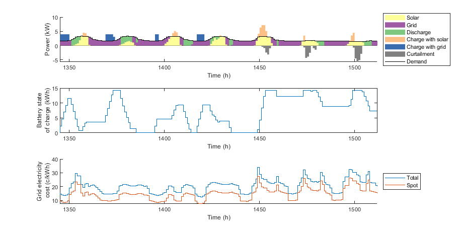
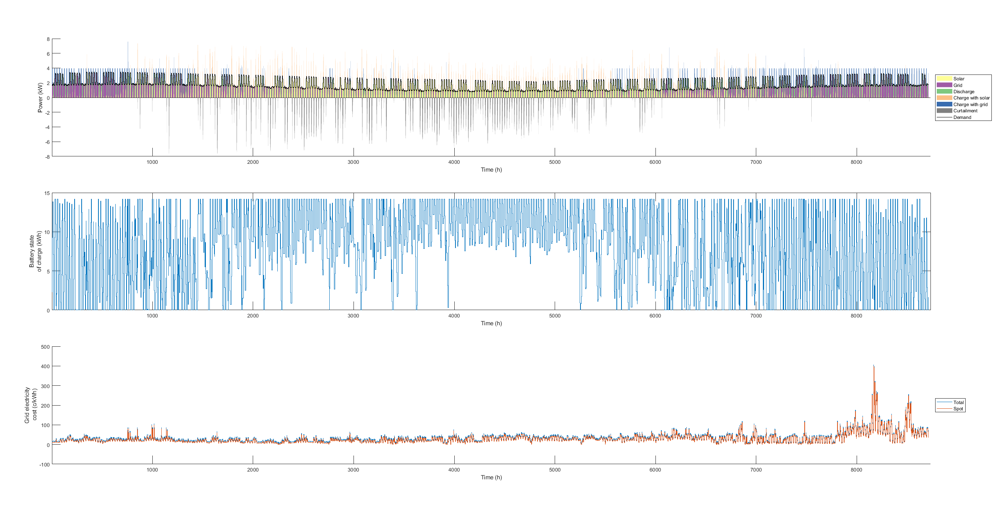

# semibrute
## semi-brute force method to optimize systems with storage
- An explicit time-marching solver for energy and mass balance with a one-hour time step. Optimize various problems that have storage, and variable costs and demands as time series. Optimize both operation and capacities
- For an optimization horizon, for example 24 h, there are 24+1 options to charge storage starting from no charge at all: charge during the cheapest hour, during two of the cheapest hours, during three of the cheapest hours etc.
- Operation of the system is optimized with the semi-brute force method
- Unit capacities can be optimized with additional optimization methods, such as genetic algorithms.

## How to run the model?
1. Set the problem up with `run_model_003_solar_PV_battery.m`
2. Set the problem up with `fun_003_solar_PV_battery.m` is called and does the main work
3. Plot results with `plot_003.m`

---
### Example week

### Example year

